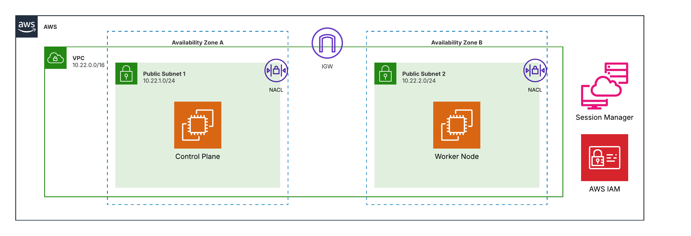

# terraform-aws-kubeadm-bootstrap

Terraform project to provision AWS networking and compute resources for a Kubernetes cluster bootstrapped manually with kubeadm. Intentionally hands-on - the kubeadm setup is done manually on EC2 to focus on core cluster bootstrapping concepts.



## Prerequisites

- Terraform >= 1.3.0
- AWS CLI configured with credentials
- AWS CLI Session Manager plugin installed

## Usage

### Local state

```bash
cd terraform
terraform init
terraform plan -var-file=terraform.tfvars
terraform apply -var-file=terraform.tfvars
```

### Remote state (S3 backend)

```bash
export TF_BACKEND_BUCKET="<your-state-bucket>"
export TF_BACKEND_REGION="us-east-1"
export TF_BACKEND_KEY="terraform/kubeadm-bootstrap/terraform.tfstate"

cd terraform
terraform init \
    -backend-config="bucket=${TF_BACKEND_BUCKET}" \
    -backend-config="key=${TF_BACKEND_KEY}" \
    -backend-config="region=${TF_BACKEND_REGION}" \
    -reconfigure

terraform plan -var-file=terraform.tfvars
terraform apply -var-file=terraform.tfvars
```

To migrate existing local state to S3:

```bash
terraform init \
    -backend-config="bucket=${TF_BACKEND_BUCKET}" \
    -backend-config="key=${TF_BACKEND_KEY}" \
    -backend-config="region=${TF_BACKEND_REGION}" \
    -migrate-state
```

## Connecting to instances

No SSH key pair - access via AWS Systems Manager Session Manager only.

```bash
# Control plane
aws ssm start-session --target <control_plane_instance_id> --region us-east-1

# Worker node
aws ssm start-session --target <worker_node_instance_id> --region us-east-1
```

The exact commands are printed as Terraform outputs after apply.

## Security groups

### Control plane inbound

| Port | Source | Purpose |
| --- | --- | --- |
| 6443 | 0.0.0.0/0 | Kubernetes API server |
| 2379-2380 | VPC CIDR | etcd |
| 10250 | VPC CIDR | kubelet API |
| 10257 | VPC CIDR | kube-controller-manager |
| 10259 | VPC CIDR | kube-scheduler |

### Worker node inbound

| Port | Source | Purpose |
| --- | --- | --- |
| 10250 | VPC CIDR | kubelet API |
| 30000-32767 | 0.0.0.0/0 | NodePort services |

Both nodes allow all outbound (SSM agent, package installs, cluster traffic).

## kubeadm setup (manual)

After `terraform apply`, connect via SSM and bootstrap the cluster:

1. Install containerd on both nodes
2. Install `kubeadm`, `kubelet`, `kubectl` on both nodes
3. On control plane: `kubeadm init --pod-network-cidr=<cidr>`
4. Install a CNI plugin (Flannel, Calico, etc.)
5. On worker node: run the `kubeadm join` command from step 3
